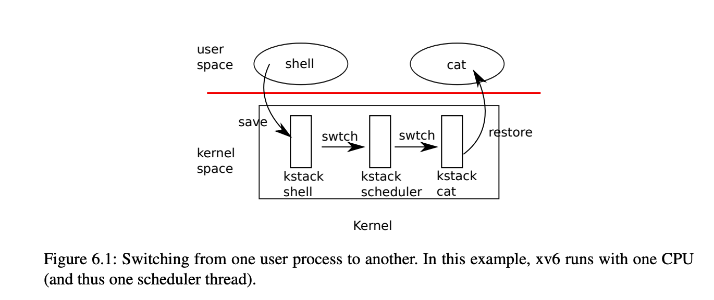

# Part 1: How to translate address

## How to translate address

a RISC-V page table is logically an array of 2^27 \(134,217,728\) page table entries \(PTEs\). The paging hardware _translates a virtual address by using the top 27 bits of the 39 bits to index into the page table to find a PTE_, and making a 56-bit physical address whose top 44 bits come from the PPN in the PTE and whose bottom 12 bits are copied from the original virtual address. Thus a page table gives the operating system control over virtual-to-physical address translations at the granularity of _aligned chunks of 4096 \(2^12\) bytes_. Such a chunk is called a page.

* The total supported number of pages are: 2^27
* Each size is 2^12.
* GB size is 2^30.
* MAXVA is actually one bit less than the max allowed by Sv39, to avoid having to sign-extend virtual addresses that have the high bit set.

  `#define MAXVA (1L << (9 + 9 + 9 + 12 - 1))`

* So the total virtual memory can support up to 2^\(27+12-30 - 1\) =&gt; 2^8. 
* The available virtual memory is 256 GB.

the actual translation happens in three steps.

kernel must write the physical address of the root page-table page into the `satp` register. Each CPU has its own `satp`.

### Open questions:

#### Why kernel maps stacks via high-memory mappings?

Read: Reference: “Understanding the Linux Kernel”, third edition - sections “8.1.3. Memory Zones” and “8.1.6. Kernel Mappings of High-Memory Page Frames”.

For 32 bit machines: Page frames above the 896 MB boundary are not generally mapped in the fourth gigabyte of the kernel linear address spaces, so the kernel is unable to directly access them.

## system/kernel/memory

